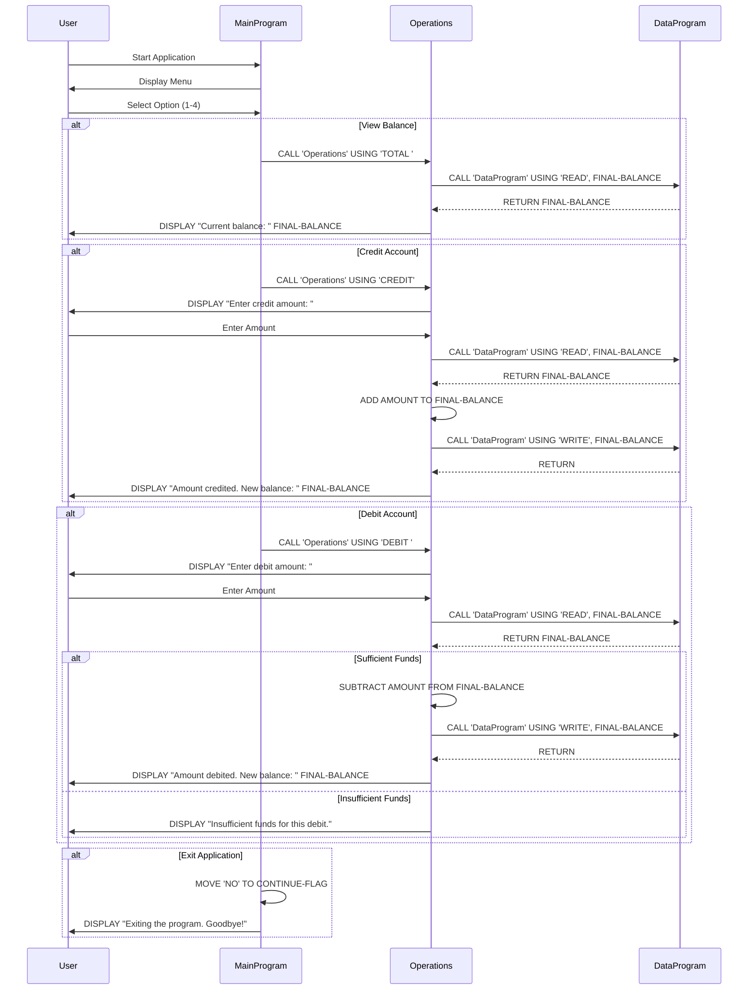

# Account Management System

A simple console-based banking system implemented in Python, originally converted from COBOL architecture. This system demonstrates modular programming principles with separate concerns for user interface, business logic, and data persistence.


## Sequence Diagram: Data Flow




## Features

- **View Balance**: Display current account balance
- **Credit Account**: Add funds to the account
- **Debit Account**: Withdraw funds from the account (with insufficient funds protection)
- **Input Validation**: Robust error handling for user inputs
- **Persistent Storage**: Balance maintained during program execution

## System Architecture

The system is designed with a modular architecture that mirrors COBOL program structure:

```
┌─────────────────┐    ┌─────────────────┐    ┌─────────────────┐
│  MainProgram    │───▶│   Operations    │───▶│  DataProgram    │
│  (UI & Menu)    │    │ (Business Logic)│    │ (Data Storage)  │
└─────────────────┘    └─────────────────┘    └─────────────────┘
```

### File Structure

```
banking-system/
├── main_program.py     # Main program with user interface
├── operations.py       # Business logic and operations
├── data_program.py     # Data storage and persistence
├── TESTPLAN.md         # Documentation for test
└── README.md           # This file

```

## Usage

### Running the Program

```bash
python main_program.py
```

### Menu Options

When you run the program, you'll see this menu:

```
--------------------------------
Account Management System
1. View Balance
2. Credit Account
3. Debit Account
4. Exit
--------------------------------
```

### Example Usage

```bash
$ python main_program.py

--------------------------------
Account Management System
1. View Balance
2. Credit Account
3. Debit Account
4. Exit
--------------------------------
Enter your choice (1-4): 1
Current balance: 1000.00

Enter your choice (1-4): 2
Enter credit amount: 250.50
Amount credited. New balance: 1250.50

Enter your choice (1-4): 3
Enter debit amount: 100.25
Amount debited. New balance: 1150.25

Enter your choice (1-4): 4
Exiting the program. Goodbye!
```

## Module Details

### MainProgram (`main_program.py`)
- **Purpose**: User interface and menu management
- **Key Methods**:
  - `run()`: Main program loop
  - `_display_menu()`: Shows menu options
  - `_get_user_choice()`: Handles menu selection with validation
  - `_get_amount()`: Validates monetary input

### Operations (`operations.py`)
- **Purpose**: Business logic for account operations
- **Key Methods**:
  - `call_program()`: Routes operations based on type
  - `_handle_view_balance()`: Retrieves current balance
  - `_handle_credit()`: Processes credit transactions
  - `_handle_debit()`: Processes debit transactions with validation

### DataProgram (`data_program.py`)
- **Purpose**: Data persistence and storage management
- **Key Methods**:
  - `call_program()`: Handles READ/WRITE operations
- **Global Function**: `call_data_program()` simulates COBOL CALL statement

## Error Handling

The system includes comprehensive error handling:

- **Invalid Menu Choices**: Prompts user to enter valid option (1-4)
- **Invalid Amounts**: Validates numeric input and positive values
- **Insufficient Funds**: Prevents debit operations that would result in negative balance
- **Data Validation**: Ensures all inputs are properly formatted

## Initial Configuration

- **Starting Balance**: $1,000.00
- **Minimum Balance**: $0.00 (no negative balances allowed)
- **Precision**: 2 decimal places for currency

## COBOL Heritage

This Python implementation maintains the architectural patterns of the original COBOL system:

- **Modular Design**: Separate programs for different concerns
- **CALL Statements**: Simulated through method calls between modules
- **Data Persistence**: Global instance pattern mimics COBOL data persistence
- **Structured Programming**: Clear separation of presentation, business logic, and data layers

# Account Management System

A simple console-based banking system implemented in Python, originally converted from COBOL architecture. This system demonstrates modular programming principles with separate concerns for user interface, business logic, and data persistence.

## Features

- **View Balance**: Display current account balance
- **Credit Account**: Add funds to the account
- **Debit Account**: Withdraw funds from the account (with insufficient funds protection)
- **Input Validation**: Robust error handling for user inputs
- **Persistent Storage**: Balance maintained during program execution

## System Architecture

The system is designed with a modular architecture that mirrors COBOL program structure:

```
┌─────────────────┐    ┌─────────────────┐    ┌─────────────────┐
│  MainProgram    │───▶│   Operations    │───▶│  DataProgram    │
│  (UI & Menu)    │    │ (Business Logic)│    │ (Data Storage)  │
└─────────────────┘    └─────────────────┘    └─────────────────┘
```

### File Structure

```
banking-system/
├── main_program.py     # Main program with user interface
├── operations.py       # Business logic and operations
├── data_program.py     # Data storage and persistence
└── README.md          # This file
```

## Installation & Setup

### Prerequisites
- Python 3.6 or higher

### Installation
1. Clone or download the project files
2. Ensure all three Python files are in the same directory
3. No additional dependencies required (uses only Python standard library)

## Usage

### Running the Program

```bash
python main_program.py
```

### Menu Options

When you run the program, you'll see this menu:

```
--------------------------------
Account Management System
1. View Balance
2. Credit Account
3. Debit Account
4. Exit
--------------------------------
```

### Example Usage

```bash
$ python main_program.py

--------------------------------
Account Management System
1. View Balance
2. Credit Account
3. Debit Account
4. Exit
--------------------------------
Enter your choice (1-4): 1
Current balance: 1000.00

Enter your choice (1-4): 2
Enter credit amount: 250.50
Amount credited. New balance: 1250.50

Enter your choice (1-4): 3
Enter debit amount: 100.25
Amount debited. New balance: 1150.25

Enter your choice (1-4): 4
Exiting the program. Goodbye!
```

## Module Details

### MainProgram (`main_program.py`)
- **Purpose**: User interface and menu management
- **Key Methods**:
  - `run()`: Main program loop
  - `_display_menu()`: Shows menu options
  - `_get_user_choice()`: Handles menu selection with validation
  - `_get_amount()`: Validates monetary input

### Operations (`operations.py`)
- **Purpose**: Business logic for account operations
- **Key Methods**:
  - `call_program()`: Routes operations based on type
  - `_handle_view_balance()`: Retrieves current balance
  - `_handle_credit()`: Processes credit transactions
  - `_handle_debit()`: Processes debit transactions with validation

### DataProgram (`data_program.py`)
- **Purpose**: Data persistence and storage management
- **Key Methods**:
  - `call_program()`: Handles READ/WRITE operations
- **Global Function**: `call_data_program()` simulates COBOL CALL statement

## Error Handling

The system includes comprehensive error handling:

- **Invalid Menu Choices**: Prompts user to enter valid option (1-4)
- **Invalid Amounts**: Validates numeric input and positive values
- **Insufficient Funds**: Prevents debit operations that would result in negative balance
- **Data Validation**: Ensures all inputs are properly formatted

## Initial Configuration

- **Starting Balance**: $1,000.00
- **Minimum Balance**: $0.00 (no negative balances allowed)
- **Precision**: 2 decimal places for currency

## Testing

The system includes comprehensive automated and manual testing procedures. For complete testing documentation, see **[TESTPLAN.md](TESTPLAN.md)**.


## Migration Process

For complete migration documentation, see **[MIGRATION.md](MIGRATION.md)**.  
This document explains the full migration workflow, including how legacy COBOL code was analyzed, converted, and modernized into Python.
